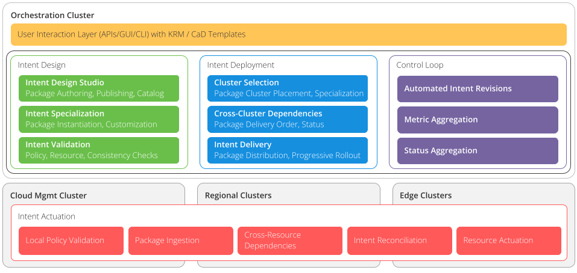

# SIG Automation
**Chair**: John Belamaric, Google, @johnbelamaric

**Vice-chair**: Wim Henderickx, Nokia, @henderiw

## Charter

As agreed to by the TSC and documented in the approved [Nephio Community
Document](https://docs.google.com/document/d/1agsjCN3aCjgPftO8AL4sCkv3Dp2ZRZ82-ikuVHAJTL8/edit?usp=sharing),
this SIG group focuses on design and standardization of schemas, CRDs, and operators; development of CRDs, Operators, related tooling & reference Implementation; and packaging and testing of functional components of Nephio.

## Subprojects

Recall the high-level functional components shown in the *Nephio Functional
Areas* figure.

The following subproject structure is defined in the terms of the figure, and
is intended to faciliate the delivery of R1. We will reconsider this structure
post-R1 for better longterm alignment with the community needs.

For each subproject, we list a lead and the scope of the subproject, as well as
the primary skills involved in participating in that subproject. As an open
community, we do not "require" any specific skills for contributors to
participate in the subproject. We hope to find ways for anyone to contribute,
and to build the necessary skills. However, it can be useful to list the primary
skills and areas of expertise involved in each group, to help people decide
where they may wish to participate.

Note that CRD design is something all teams will do, though each subproject will
have a different set of CRDs to work on based on their scope. Subprojects should
review each others' CRD proposals to ensure consistency and that they work
together as expected. Post R1, we will likely need to introduce an API review
subproject, similar to the
[one](https://github.com/kubernetes/community/tree/master/sig-architecture#architecture-and-api-governance-1)
in Kubernetes.

### Package Management
**Subproject Lead**: John Belamaric, @johnbelamaric

**Scope**
- User Interaction Layer
- Intent Design
  - Intent Design
  - Intent Specialization
  - Intent Validation
- Intent Deployment
  - Cluster Selection
  - Cross-Cluster Dependencies

In terms of package lifecycle, this includes everything up to and including fan
out, where the initial instances of per-cluster packages have been created and
have had basic variance injected by the PackageVariant controller. It does not
include additional per-cluster specialization done after fan out.

In terms of known R1 components, this subproject will focus on:
- Topology controllers
- High-level intent controllers
- Porch and Porch enhancements (PackageVariant, PackageVariantSet)
  - General purpose package management components and tooling
  - Packages, PackageRevisions
  - PackageVariant controller enhancement design and implementation
  - PackageVariantSet controller enhancement design and implementation
  - Cross-package dependencies
  - Mostly this will be upstream in Porch/kpt though dependencies we may do in
    Nephio repositories and upstream it later, if appropriate
- Nephio UI
  - Likely in R1 this will be simply minor enhancements to the Porch/workshop UI
  - A Nephio-specific UI is desirable in the future

**Primary Skills**
- Kubernetes Basics, [Kubernetes Resource Model](https://github.com/nephio-project/docs/blob/main/glossary.md#kubernetes-resource-model) (KRM)
- Kubernetes [CRD](https://github.com/nephio-project/docs/blob/main/glossary.md#custom-resource-definition) and
  [Controller](https://github.com/nephio-project/docs/blob/main/glossary.md#controller) Design
- [Configuration](https://github.com/nephio-project/docs/blob/main/glossary.md#configuration) Management, specifically [kpt](https://github.com/nephio-project/docs/blob/main/glossary.md#kpt) and [Porch](https://github.com/nephio-project/docs/blob/main/glossary.md#porch), and concepts such as:
  - [Hydration](https://github.com/nephio-project/docs/blob/main/glossary.md#hydration)
  - [Fan out](https://github.com/nephio-project/docs/blob/main/glossary.md#fanout) and more general [variant generation](https://github.com/nephio-project/docs/blob/main/glossary.md#variant-generation)
  - [Value propagation](https://github.com/nephio-project/docs/blob/main/glossary.md#value-propagation)
- [KRM
  Functions](https://github.com/nephio-project/docs/blob/main/glossary.md#krm-function)
- Go programming for controllers
- UI Design and development
  - Current prototype is a lightly modified version of the [Porch
    UI](https://github.com/GoogleContainerTools/kpt-backstage-plugins)
  - This is a [Backstage](https://backstage.io) Plugin, based on
    [React](https://reactjs.org/) primarily
  - Post R1, technology of a Nephio-specific UI is an open question
- Telco network function topology and architectures

### Package Specialization
**Interim Subproject Lead**: Wim Henderickx, @henderiw

*Note*: Wim is looking for someone to grow into replacing him in this role
as soon as possible.

**Scope**
- Intent Design
  - Intent Validation (cluster specific)
- Intent Deployment
  - Cluster Selection / Specialization
  - Intent Delivery
- Control Loop
  - Automated Intent Revisions
  - Metric Aggregation
  - Status Aggregation

In terms of package lifecycle, this includes everything that happens in the
management cluster after fan out. Thus, it includes all coordinated injectors
and controllers that operate on package conditions, as well as any automated
controllers for validating, proposing, and approving cluster-specific packages.

In terms of known R1 components, this subproject will focus on:
- Injectors
  - IP Injector
  - NAD Injector or Function
  - Possibly a VLAN ID injector
  - NF Injector if needed
  - Others TBD
- IPAM/VLAN Controller
- Status gathering (Edge Watcher)
- Status aggregation

**Primary Skills**
- Kubernetes Basics, [Kubernetes Resource Model](https://github.com/nephio-project/docs/blob/main/glossary.md#kubernetes-resource-model) (KRM)
- Kubernetes [CRD](https://github.com/nephio-project/docs/blob/main/glossary.md#custom-resource-definition) and
  [Controller](https://github.com/nephio-project/docs/blob/main/glossary.md#controller) Design
- [Package conditions](https://github.com/nephio-project/docs/blob/main/glossary.md#package-condition) and [injectors](https://github.com/nephio-project/docs/blob/main/glossary.md#injector) (rather than PackageVariant, etc)
- [KRM
  Functions](https://github.com/nephio-project/docs/blob/main/glossary.md#krm-function)
- Go programming for controllers
- Knowledge of network function requirements such as:
  - IP Address Management
  - Interface configuration (VLAN assignment for example)
  - CNI
- Knowledge of existing NF Kubernetes deployments (Helm charts and similar packages)

### Workload Cluster
**Subproject Lead**: Tal Liron, @tliron

**Scope**
- Intent Actuation
  - Local Policy Validation
  - Package Ingestion (git syncing)
  - Cross-Resource Dependencies
  - Intent Reconciliation
  - Resource Actuation

In terms of package lifecycle, this includes everything that happens after the
package is approved in the deployment repository.

In terms of known R1 components, this subproject will focus on:
- ConfigSync in the workload clusters
- free5gc Operator
- NAD configuration
- Other node-level network or kernel configuration

**Primary Skills**
- Network functions generally, and free5gc in particular
- Kubernetes Basics, [Kubernetes Resource Model](https://github.com/nephio-project/docs/blob/main/glossary.md#kubernetes-resource-model) (KRM)
- Kubernetes [CRD](https://github.com/nephio-project/docs/blob/main/glossary.md#custom-resource-definition) and
  [Controller](https://github.com/nephio-project/docs/blob/main/glossary.md#controller) Design
- Go programming for controllers
- Knowledge of network function requirements such as:
  - IP Address Management
  - Interface configuration (VLAN assignment for example)
  - CNI
- Multus
